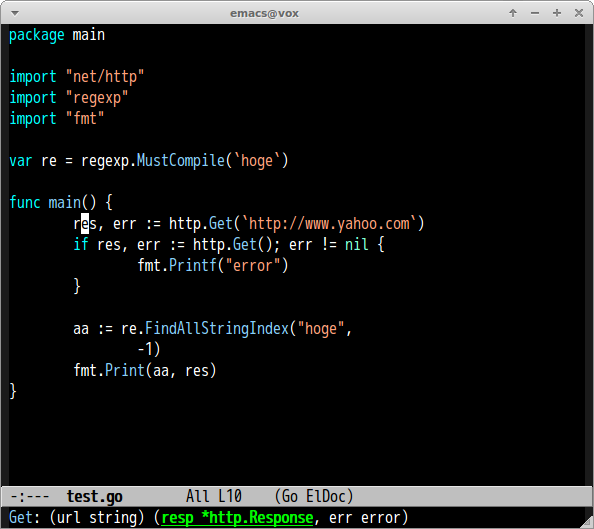

# go-eldoc.el [![travis badge][travis-badge]][travis-link] [![melpa badge][melpa-badge]][melpa-link] [![melpa stable badge][melpa-stable-badge]][melpa-stable-link]

## Introduction

`go-eldoc.el` provides eldoc for Go language. `go-eldoc.el` shows type information
for variable, functions and current position of function.


## Screenshot

### Argument Type of Function


### Variable Type Information


### Return Value Type




## Dependency

* [gocode](https://github.com/nsf/gocode)
* [go-mode](https://github.com/dominikh/go-mode.el)

You can install `go-mode` with package.el from [MELPA](http://melpa.milkbox.net/).
And you can install `gocode` by `go get` as below.

```
% go get -u github.com/nsf/gocode
```


## Installation

You can install `go-eldoc.el` from [MELPA](http://melpa.milkbox.net/) with package.el.

```lisp
(require 'package)
(add-to-list 'package-archives '("melpa" . "http://melpa.org/packages/"))
(package-initialize)
(package-refresh-contents)
```

evaluate this code and <kbd>M-x package-install go-eldoc</kbd>.


## Setup
Call `go-eldoc-setup` function at `go-mode-hook`

```lisp
(require 'go-eldoc) ;; Don't need to require, if you install by package.el
(add-hook 'go-mode-hook 'go-eldoc-setup)
```

## Customize
You can change face of current argument position by `eldoc-highlight-function-argument`
like this.

```lisp
(set-face-attribute 'eldoc-highlight-function-argument nil
                    :underline t :foreground "green"
                    :weight 'bold)
```

#### `go-eldoc-gocode`(Default: `gocode`)

`gocode` location. You need not to set this variable if you set (`$GOPATH/bin`) to PATH environment variable correctly.


[travis-badge]: https://travis-ci.org/syohex/emacs-go-eldoc.svg
[travis-link]: https://travis-ci.org/syohex/emacs-go-eldoc
[melpa-link]: http://melpa.org/#/go-eldoc
[melpa-stable-link]: http://stable.melpa.org/#/go-eldoc
[melpa-badge]: http://melpa.org/packages/go-eldoc-badge.svg
[melpa-stable-badge]: http://stable.melpa.org/packages/go-eldoc-badge.svg
